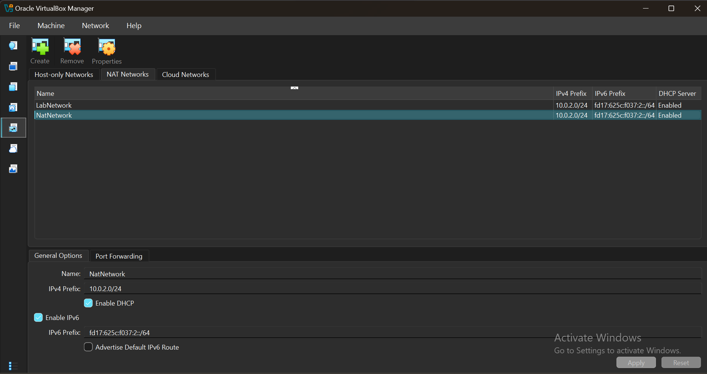

# NETWORKWALKS-B083A-WK1-PM1-CYBERSECURITY-LAB-SETUP

## Cybersecurity Lab Environmental Setup
Building an Isolated virtual lab built with VirtualBox and Kali Linux machine for Cyberscurity testing and penetration testing. 
## Project Overview 
This project focuses on setting up a virtual cybersecurity and penetration-testing laboratory using VirtualBox and Kali Linux. 
The aim of the lab is to create a sandbox environment where cybersecurity tools, network scanning, reconnaissance, vulnerability assessment, and other security activities can be performed safely and frequently.
The lab is configured on a private virtual network to allow additional machines to be added later on and also used as targets for authorized security testing 
## Objectives
The major aim of this project is to;
* Install and configure VirtueBox
* Install and Kali Linux as a virtual machine
* Select a private NAT Network for the cybersecurity lab
* Configure network and ensure connectivity for Kali Linux
* Assign a static IP address to the Kali VM.
* Verify network connecting and DNS resolution
* Take a snapshot of the VM for easy data recovery
* Document the entire setup process
* Prepare the environment for future cybersecurity projects
## Purpose of the lab
The lab supported an isolated and controlled environment for cybersecurity learning and authorized security testing.
Also, it can be used for activities like;
* Network reconnaissance
* Port scanning
* Vulnerability assessment
* Packet analysis
* Web security testing
* Exploitation practice
* Security-tool experimentation
  
⚠️ It is important to note that this laboratory must only be used for systems that you own and have proper permission to test. Ensure not to use the lab or its tools to attack unauthorized systems.
## ⚙️ Lab Configure
| 🧩 Component | ⚙️ Configuration | 
|--------------|-------------------|
| 💻 Host OS   | Windows 11        | 
| 🧠 Host Ram  | 16 GB             | 
| ⚡Processor  | Intel Core i7     |
| 🧰 Hypervisor | VirtualBox 7.2    |
| 🐉 Security OS | Kali Linux 2026.2 |
| 🧠 Kali RAM   | 2048 MB           |
| 🌎 Virtual Network | NAT Network  |
| 📡 Network Address | 10.0.0.0/24  |
| 🦤 Kali IP Address | 10.0.0.2/24  |
| 🚪 Default Gateway | 10.0.0.1     |
| 🌎 DNS Server      | 8.8.8.8      |
# Lab Setup Procedure
## Step 1. Install 7-Zip
In order to extract the Kali Linux virtual machine package, 7-zip was installed to extract it, because the package downloaded as a .7z archive.
Tool: 7-Zip
## Step 2. Install Virtual Box
VirtualBox was installed as the Hypervisor
## Step 3. Create the NAT Network
A NAT Network was created in the VirtualBox
Configuration: Network Name: NatNetwork IPv4 Prefix: 10.0.0.0/24 DHCP: Enabled IPv6: Enabled

A NAT Network was selected because it allows more than one virtual machines connected on the same NAT Network to communicate with each other while also having outbound network connection.

This network makes room for future attacker and target VMs to communicate within the lab.
## Step 4. Import Kali Linux
Kali Linux virtual machine was downloaded from the official Kali Linux website and it was imported into VirtualBox.

The VM network adapter was configured as follows:

